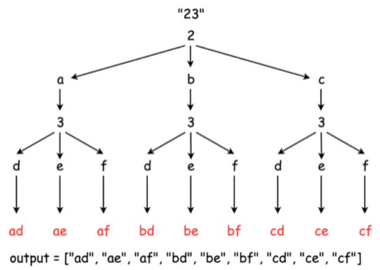

# 017 电话号码的字母组合

## 题目

    给定一个仅包含数字 2-9 的字符串，返回所有它能表示的字母组合。
    给出数字到字母的映射如下（与电话按键相同）。注意 1 不对应任何字母。


## 示例

+ 输入："23"
+ 输出：["ad", "ae", "af", "bd", "be", "bf", "cd", "ce", "cf"]
+ 说明: 尽管上面的答案是按字典序排列的，但是你可以任意选择答案输出的顺序

***

## 思路

1. 分析题目，2-9每个数字对应3个字母，给定的字符串是由数字2-9组成，让根据映射关系输出所有数字对应的字母组合，顺序可以不管;
2. 首先我们可以使用回溯法，给出如下回溯函数 backtrack(combination, next_digits) ，它将一个目前已经产生的组合 combination 和接下来准备要输入的数字 next_digits 作为参数；如果没有更多的数字需要被输入，那意味着当前的组合已经产生好了;如果还有数字需要被输入：遍历下一个数字所对应的所有映射的字母。将当前的字母添加到组合最后，也就是 combination = combination + letter；递归重复这个过程，输入剩下的数字：backtrack(combination + letter, next_digits[1:])；


3. 我们可以进行优化，采用深度优先搜索算法，也就是DFS,常用写法：
    1. 大致的模样就是循环+递归

    ```java 
    for(i = 0; i < len; i++){
        dfs(data, i);
    }
    ```

    1. 在dfs函数中也是循环+递归，不过要有两个部分，一个部分是结束条件，另一个部分是继续搜索

    ```java
    dfs(data, level) {
        if(满足结束条件){
            return somedata;
        } else {
            for(..) {dfs(data, level + 1)}
        }
    }
    ```  

4. 还可以使用队列先进先出的规律来循环填入组合后的数字来简化一层循环，通过队列的peek()方法获取队列顶端的元素长度来决定是否跳出循环，循环里面每remove()一个字母，就将该字母的所有组合输出保存，最终全部匹配完毕输出即可

***

## 复杂度分析

+ 时间复杂度 $O(3^N\times4^N)$：其中 N 是输入数字中对应 3 个字母的数目（比方说 2，3，4，5，6，8）， M 是输入数字中对应 4 个字母的数目（比方说 7，9），N+M 是输入数字的总数
+ 空间复杂度 $O(3^N\times4^N)$：这是因为需要保存$3^N\times4^N$个结果

***

## 代码

### 附上java,python3的实现代码

#### java方法

+ 回溯：
  
```java 
class Solution {
  Map<String, String> phone = new HashMap<String, String>() {{
    put("2", "abc");
    put("3", "def");
    put("4", "ghi");
    put("5", "jkl");
    put("6", "mno");
    put("7", "pqrs");
    put("8", "tuv");
    put("9", "wxyz");
  }};

  List<String> output = new ArrayList<String>();

  public void backtrack(String combination, String next_digits) {
    // if there is no more digits to check
    if (next_digits.length() == 0) {
      // the combination is done
      output.add(combination);
    }
    // if there are still digits to check
    else {
      // iterate over all letters which map 
      // the next available digit
      String digit = next_digits.substring(0, 1);
      String letters = phone.get(digit);
      for (int i = 0; i < letters.length(); i++) {
        String letter = phone.get(digit).substring(i, i + 1);
        // append the current letter to the combination
        // and proceed to the next digits
        backtrack(combination + letter, next_digits.substring(1));
      }
    }
  }

  public List<String> letterCombinations(String digits) {
    if (digits.length() != 0)
      backtrack("", digits);
    return output;
  }
}
```

+ DFS
  
```java
class Solution {
    private List<String> result = new ArrayList<>();
  
    private char[][] chars = new char[10][];
  
    // 输入的数字
    private int[] numbers;
  
    public List<String> letterCombinations(String digits) {
        if (digits == null || "".equals(digits)) {
            return result;
        }

        chars[2] = new char[]{'a', 'b', 'c'};
        chars[3] = new char[]{'d', 'e', 'f'};
        chars[4] = new char[]{'g', 'h', 'i'};
        chars[5] = new char[]{'j', 'k', 'l'};
        chars[6] = new char[]{'m', 'n', 'o'};
        chars[7] = new char[]{'p', 'q', 'r', 's'};
        chars[8] = new char[]{'t', 'u', 'v'};
        chars[9] = new char[]{'w', 'x', 'y', 'z'};

        // 初始化输入
        char[] input = digits.toCharArray();
        numbers = new int[input.length];
        for (int i = 0; i < input.length; i++) {
            numbers[i] = input[i] - 48;
        }

        // 开始深度搜索
        for (int i = 0; i < chars[numbers[0]].length; i++) {
            dfs(chars[numbers[0]][i] + "", 1);
        }
        return result;
    }

    private void dfs(String preStr, int level) {
        if (level == numbers.length) {
            result.add(preStr);
        } else {
            char[] chars = this.chars[numbers[level]];
            for (char ch : chars) {
                dfs(preStr + ch, level + 1);
            }
        }
    }
}
```
  
+ 使用队列简化
  
```java
class Solution {
    public List<String> letterCombinations(String digits) {
            LinkedList<String> ans = new LinkedList<String>();
            if(digits.isEmpty()) return ans;
            String[] mapping = new String[] {"0", "1", "abc", "def", "ghi", "jkl", "mno", "pqrs", "tuv", "wxyz"};
            ans.add("");
            for(int i =0; i<digits.length();i++){
                int x = Character.getNumericValue(digits.charAt(i));
                while(ans.peek().length()==i){
                    String t = ans.remove();
                    for(char s : mapping[x].toCharArray())
                        ans.add(t+s);
                }
            }
            return ans;
        }
}
```

#### python3方法

+ 回溯
  
```python 
class Solution:
    def letterCombinations(self, digits):
        """
        :type digits: str
        :rtype: List[str]
        """
        phone = {'2': ['a', 'b', 'c'],
                 '3': ['d', 'e', 'f'],
                 '4': ['g', 'h', 'i'],
                 '5': ['j', 'k', 'l'],
                 '6': ['m', 'n', 'o'],
                 '7': ['p', 'q', 'r', 's'],
                 '8': ['t', 'u', 'v'],
                 '9': ['w', 'x', 'y', 'z']}
        def backtrack(combination, next_digits):
            # if there is no more digits to check
            if len(next_digits) == 0:
                # the combination is done
                output.append(combination)
            # if there are still digits to check
            else:
                # iterate over all letters which map 
                # the next available digit
                for letter in phone[next_digits[0]]:
                    # append the current letter to the combination
                    # and proceed to the next digits
                    backtrack(combination + letter, next_digits[1:])       
        output = []
        if digits:
            backtrack("", digits)
        return output
```

+ DFS
  
```python
class Solution:
    def letterCombinations(self, digits: str) -> List[str]:
        lookup = {
            "2":"abc",
            "3":"def",
            "4":"ghi",
            "5":"jkl",
            "6":"mno",
            "7":"pqrs",
            "8":"tuv",
            "9":"wxyz"
        }
        if not digits:
            return []
        res = [""]
        for num in digits:
            next_res = []
            for alp in lookup[num]:
                for tmp in res:
                    next_res.append(tmp + alp)
            res = next_res
        return res
```

+ python3 简化
  

```python
class Solution:
    def letterCombinations(self, digits: str) -> List[str]:
        m = {
            '2': list('abc'),
            '3': list('def'),
            '4': list('ghi'),
            '5': list('jkl'),
            '6': list('mno'),
            '7': list('pqrs'),
            '8': list('tuv'),
            '9': list('wxyz'),
            }
        if not digits: return []
        ls1 = ['']
        for i in digits:
            ls1 = [x + y for x in ls1 for y in m[i]]
        return ls1
```
