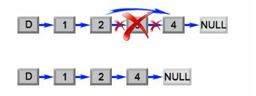

# 019 删除链表的倒数第N个节点

## 题目

给定一个链表，删除链表的倒数第 n 个节点，并且返回链表的头结点。

### 示例

+ 给定一个链表: 1->2->3->4->5, 和 n = 2.

+ 当删除了倒数第二个节点后，链表变为 1->2->3->5.
  
### 说明

+ 给定的 n 保证是有效的。

### 进阶

+ 你能尝试使用一趟扫描实现吗？

***

## 思路

1. 分析题目，让删除给定链表的倒数第n个节点，假设链表长度为L，倒数第n个就等于正数第L-n+1个;
2. 遇到链表，首先想到哑结点，哑结点可以简化对链表的极端情况处理，比如链表只有一个结点，或者删除头结点等问题；
3. 首先第一种方法，我们可以先遍历一次列表并找出长度L，然后设置一个指针指向哑节点，并不断移动它遍历第二次，直到它到达L-n个结点那里，最后我们只需要将（L-n）结点的next指针指向（l-n+2）结点，并返回链表头结点，就可以了；

    

4. 第二种方法，我们可以挑战一下进阶中要求的使用一趟扫描实现，要想遍历一次就找到要删除的结点，我们可以使用快慢指针法，也就是双指针法，首先定义两个指针指向哑节点，然后移动一个快指针移动n+1步移动到第n个结点处，然后同时移动两个指针，这样两个指针之间始终保持n个结点的间距，这样当快指针移动到链表结尾时，慢指针对应的就是倒数第n个结点，我们将慢指针对应结点的next指针指向下下个结点，并返回链表头结点即可；


5. 两种方案，前者需要遍历两次，后者只需要遍历一次即可，我们可以都使用哑节点来简化操作

***

## 复杂度分析

+ 时间复杂度 $O(L)$：第一种算法对列表进行了两次遍历，首先计算了列表的长度L，然后找到第 (L - n) 个结点。 操作执行了 2L-n步，时间复杂度为 O(L)。第二种算法队列表进行了一次遍历，操作快指针执行了L步，时间复杂度O(L)
+ 空间复杂度 $O(1)$：占用空间是常量级的

***

## 代码

### 附上java,python3的实现代码

#### java方法

+ 方法一
  
```java
/**
 * Definition for singly-linked list.
 * public class ListNode {
 *     int val;
 *     ListNode next;
 *     ListNode(int x) { val = x; }
 * }
 */
class Solution {
    public ListNode removeNthFromEnd(ListNode head, int n) {
        ListNode dummy = new ListNode(0);
        dummy.next = head;
        int length  = 0;
        ListNode first = head;
        while (first != null) {
            length++;
            first = first.next;
        }
        length -= n;
        first = dummy;
        while (length > 0) {
            length--;
            first = first.next;
        }
        first.next = first.next.next;
        return dummy.next;
    }
}
```

+ 方法二
  
```java
/**
 * Definition for singly-linked list.
 * public class ListNode {
 *     int val;
 *     ListNode next;
 *     ListNode(int x) { val = x; }
 * }
 */
class Solution {
    public ListNode removeNthFromEnd(ListNode head, int n) {
        ListNode dummy = new ListNode(0);
        dummy.next = head;
        ListNode first = dummy;
        ListNode second = dummy;
        // 将快指针移动n+1步
        for (int i = 1; i <= n + 1; i++) {
            first = first.next;
        }
        // 同时移动两个指针，直到快指针指向链表结尾
        while (first != null) {
            first = first.next;
            second = second.next;
        }
        second.next = second.next.next;
        return dummy.next;
    }
}
```

#### python3方法

+ 方法一
  
```python
# Definition for singly-linked list.
# class ListNode:
#     def __init__(self, x):
#         self.val = x
#         self.next = None

class Solution:
    def removeNthFromEnd(self, head: ListNode, n: int) -> ListNode:
        dummy = ListNode(0)
        dummy.next = head
        first = head
        length = 0
        while first is not None:
            length = length+1
            first = first.next
        length = length - n
        first = head
        while length >0:
            length = length-1
            first = first.next
        first.next = first.next.next
        return dummy.next
```

+ 方法二
  
```python
# Definition for singly-linked list.
# class ListNode:
#     def __init__(self, x):
#         self.val = x
#         self.next = None

class Solution:
    def removeNthFromEnd(self, head: ListNode, n: int) -> ListNode:
        dummy = ListNode(0)
        dummy.next = head
        fast,slow = dummy,dummy
        for  i in range(n+1):
            fast = fast.next
        while fast is not None:
            fast = fast.next
            slow = slow.next
        slow.next = slow.next.next
        return dummy.next

```
