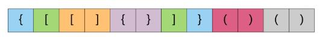
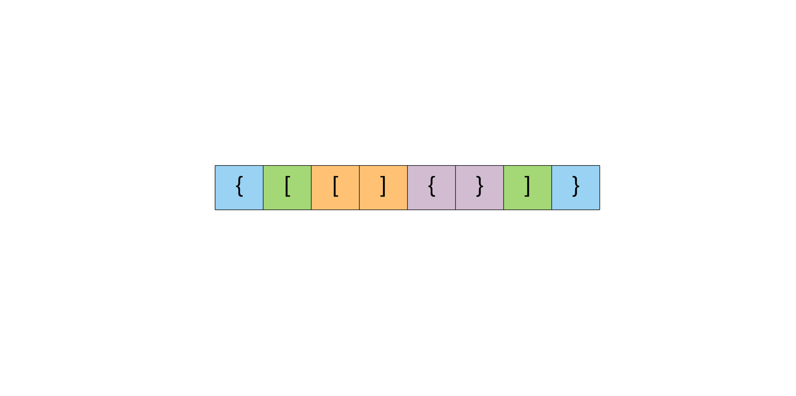
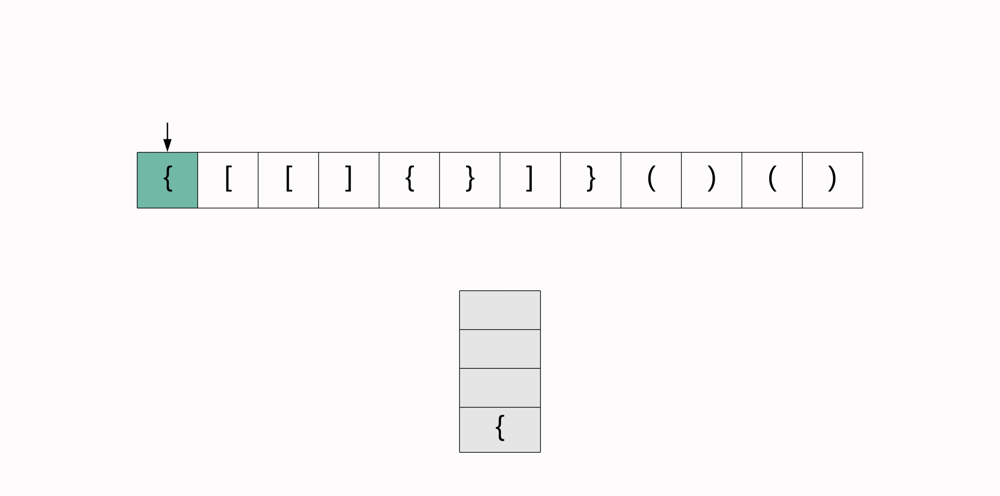

# 020 有效的括号

## 题目

给定一个只包括 '('，')'，'{'，'}'，'['，']' 的字符串，判断字符串是否有效。

有效字符串需满足：

1. 左括号必须用相同类型的右括号闭合。
2. 左括号必须以正确的顺序闭合。

- 注意空字符串可被认为是有效字符串。

### 示例 1

    输入: "()"
    输出: true

### 示例 2

    输入: "()[]{}"
    输出: true
### 示例 3

    输入: "(]"
    输出: false

### 示例 4

    输入: "([)]"
    输出: false

### 示例 5

    输入: "{[]}"
    输出: true

***

## 思路

1. 分析题目，判断给定的字符串是否有效，字符串中只包含3种左右括号;
2. 看到括号首先想到的是对称，有多少左括号，就要有多少又括号；其次最内部最小单元的左括号应该首先遇到同类型的右括号，反过来理解就是当第一次遇到一个右括号，那么上一次也就是遇到这个右括号之前那次遇到的符号一定要是同类型的左括号才是有效的括号组合；

      

3. 如上图，如果这个字符串里的括号是有效的，那么它肯定是要以左括号开始，我们自然会想到去存储左括号，然后每遇到一个对应的又括号，就从存储中去掉；如果最终遍历完，全部匹配，没有多余的左括号也没有遇到找不到对应的右括号，那这个字符串就是有效的；

  
4. 我们观察这个过程后，会发现最左边的括号会在最后进行匹配，如果我们通过存储左括号，然后遇到一个匹配的右括号再把对应的左括号删除的话，那么只能删除符合对称且距离改右括号最近的才可以；这个过程就是先进后出(FILO),符合栈的特点；

  
5. 我们细化具体的操作，首先要将三种括号的左括号和右括号对应关系以右括号为key存入到hashmap中，因为本题本质上就是需要右括号去查找满足条件的左括号，然后我们需要初始化一个Character泛型的栈；
6. 使用hashmap和栈的特性从左到右一次处理每一个括号，会遇到如下情况：
    + 如果是左括号就入栈；
    + 如果是右括号就和栈顶的左括号进行匹配，如果括号类型匹配，就弹出该左括号，循环继续下一个括号的匹配；否则就表示该字符串里的括号无效；
    + 如果遍历完后，发现栈里还有元素，也就是还有左括号，就表示字符串里的括号无效；

***

## 复杂度分析

- 时间复杂度 $O(n)$：入栈和出栈和hashmap查询的时间复杂度是$O(1)$,而且我们只需要遍历一次字符串就可以得出结论；
- 空间复杂度 $O(n)$：最多情况下，所有的符号都是左括号，这样我们需要占用n的空间存储所有的括号

***

## 代码

### 附上java,python3的实现代码

#### java方法
  
```java
class Solution {

  // 声明hash表负责存储同类型左右括号，并维持对应关系
  private HashMap<Character, Character> mappings;
  // 赋值
  public Solution() {
    this.mappings = new HashMap<Character, Character>();
    this.mappings.put(')', '(');
    this.mappings.put('}', '{');
    this.mappings.put(']', '[');
  }

  public boolean isValid(String s) {

    // 初始化一个Character泛型的栈
    Stack<Character> stack = new Stack<Character>();

    for (int i = 0; i < s.length(); i++) {
      char c = s.charAt(i);

      // 如果是右括号
      if (this.mappings.containsKey(c)) {

        // 和栈顶元素进行匹配，如果栈为空，初始化一个不为任何括号的‘#’
        char topElement = stack.empty() ? '#' : stack.pop();

        // 如果不匹配返回false.
        if (topElement != this.mappings.get(c)) {
          return false;
        }
      } else {
        // 如果是左括号就入栈
        stack.push(c);
      }
    }

    // 循环结束后，看栈是否为空，如果不为空，同样返回false，为空就说明全部匹配，返回true
    return stack.isEmpty();
  }
}
```

#### python3方法

```python
class Solution(object):
    def isValid(self, s):
        """
        :type s: str
        :rtype: bool
        """

        # 声明一个用来存储左括号的栈
        stack = []
        # 声明hash表负责存储同类型左右括号，并维持对应关系
        mapping = {")": "(", "}": "{", "]": "["}

        # 遍历所有的括号
        for char in s:

            # 如果是右括号
            if char in mapping:

                # 和栈顶元素进行匹配，如果栈为空，初始化一个不为任何括号的‘#’
                top_element = stack.pop() if stack else '#'

                # 如果不匹配返回false.
                if mapping[char] != top_element:
                    return False
            else:
                # 如果是左括号就入栈
                stack.append(char)

        # 循环结束后，看栈是否为空，如果不为空，同样返回false，为空就说明全部匹配，返回true
        return not stack
```
