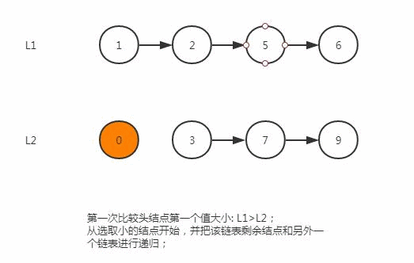

# 021 合并两个有序链表

## 题目

将两个有序链表合并为一个新的有序链表并返回。新链表是通过拼接给定的两个链表的所有节点组成的。

示例：

```txt
    输入：1->2->4, 1->3->4
    输出：1->1->2->3->4->4
```

***

## 思路

1. 分析题目，让合并两个给定的有序链表为一个新的有序链表;
2. 首先根据示例及题目可以发现，合并后是完整的数据。也就是如果两个链表有相同的数字，是都要合并在新链表里的；合并的过程就是按顺序分别比较两个链表头结点的大小，然后获取这个值，并用上一个值的next指向这个较小的数字。然后在原链表中去掉这个头结点，如此往复直到某个链表遍历完；当某个链表为空，或者某个链表遍历完之后，就表示另一个链表的最小部分是要大于目前已保存的新链表的最大部分的，因此可以直接返回另外一个链表，这部分逻辑是相同的。到这里会发现，整个遍历过程是递归性质的，因此我们首先可以使用递归的方法解决这个问题；

    

3. 深入理解之后我们还可以对递归方法进行优化，就是不断的让一个链表里面的值插入到另一个链表中，也就是不在返回新的链表，而是去重组链表以节省空间，这种方法是迭代法，类似于归并排序的合并过程，具体做法就是首先使用一个哑节点prehead，让它指向两个链表头结点较小的值，然后后面再让这个头结点指向新的较小的值，最终遍历完某个链表后，让这个链表最后一个值指向另一个链表剩余的结点，然后返回prehead的next就是所求的合并后的有序链表；

***

## 复杂度分析

### 递归法

- 时间复杂度 $O(n + m)$：因为每次调用递归都会去掉 l1 或者 l2 的头元素（直到至少有一个链表为空），函数 mergeTwoList 中只会遍历每个元素一次。所以，时间复杂度与合并后的链表长度为线性关系；
- 空间复杂度 $O(n + m)$：调用 mergeTwoLists 退出时 l1 和 l2 中每个元素都一定已经被遍历过了，所以n+m 个栈帧会消耗 $O(n + m)$ 的空间

### 迭代法

- 时间复杂度 $O(n + m)$：因为每次调用递归都会去掉 l1 或者 l2 的头元素（直到至少有一个链表为空），函数 mergeTwoList 中只会遍历每个元素一次。所以，时间复杂度与合并后的链表长度为线性关系；
- 空间复杂度 $O(1)$：迭代的过程只会产生几个指针，所以它所需要的空间是常数级别的。

***

## 代码

### 附上java,python3的实现代码

#### java方法

- 递归

```java
/**
 * Definition for singly-linked list.
 * public class ListNode {
 *     int val;
 *     ListNode next;
 *     ListNode(int x) { val = x; }
 * }
 */
class Solution {
    public ListNode mergeTwoLists(ListNode l1, ListNode l2) {
        if (l1 == null) {
            return l2;
        }
        else if (l2 == null) {
            return l1;
        }
        else if (l1.val < l2.val) {
            l1.next = mergeTwoLists(l1.next, l2);
            return l1;
        }
        else {
            l2.next = mergeTwoLists(l1, l2.next);
            return l2;
        }

    }
}
```

- 迭代

```java
/**
 * Definition for singly-linked list.
 * public class ListNode {
 *     int val;
 *     ListNode next;
 *     ListNode(int x) { val = x; }
 * }
 */
class Solution {
    public ListNode mergeTwoLists(ListNode l1, ListNode l2) {
        // 声明一个哑节点prehead
        ListNode prehead = new ListNode(-1);
        // 维护一个prev指针，用来调整链表next指向
        ListNode prev = prehead;
        while (l1 != null && l2 != null) {
            if (l1.val <= l2.val) {
                prev.next = l1;
                l1 = l1.next;
            } else {
                prev.next = l2;
                l2 = l2.next;
            }
            prev = prev.next;
        }
        // 当一个链表为空后，指向另一个剩余部分的链表
        prev.next = l1 == null ? l2 : l1;

        return prehead.next;
    }
}
```

#### python3方法

- 递归

```python
class Solution:
    def mergeTwoLists(self, l1, l2):
        if l1 is None:
            return l2
        elif l2 is None:
            return l1
        elif l1.val < l2.val:
            l1.next = self.mergeTwoLists(l1.next, l2)
            return l1
        else:
            l2.next = self.mergeTwoLists(l1, l2.next)
            return l2
```

- 迭代

```python
class Solution:
    def mergeTwoLists(self, l1, l2):
        # 声明一个哑节点prehead
        prehead = ListNode(-1)
        # 维护一个prev指针，用来调整链表next指向
        prev = prehead
        while l1 and l2:
            if l1.val <= l2.val:
                prev.next = l1
                l1 = l1.next
            else:
                prev.next = l2
                l2 = l2.next
            prev = prev.next

        # 当一个链表为空后，指向另一个剩余部分的链表
        prev.next = l1 if l1 is not None else l2

        return prehead.next
```
